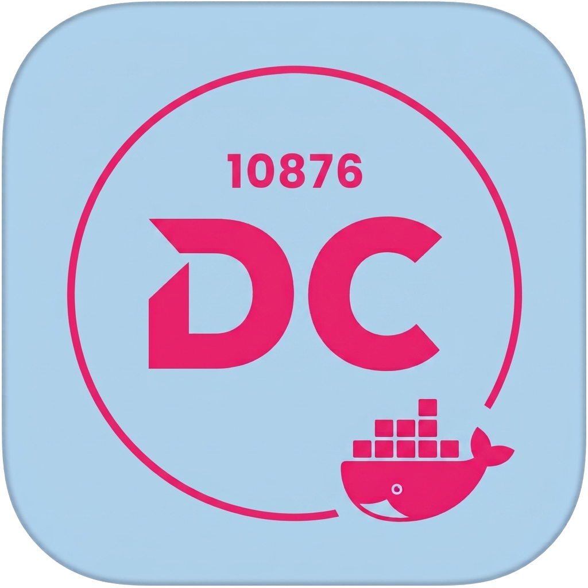

<div align="center">

<h1 align="center" style="margin-top: 0">DockerCopilot</h1>
</div>

> **Fork 声明**：本项目 fork 自 [onlyLTY/dockerCopilot](https://github.com/onlyLTY/dockerCopilot)，
> 在其基础上进行了修改与功能新增（如容器文件管理器、任务中心、镜像图标自适应等）。
> 原始版权归原作者 **onlyLTY** 及其贡献者所有，特此致谢。
> 本 Fork 依据 AGPLv3 继续开源，详见 [LICENSE](./LICENSE)。
>
> 衷心感谢原作者 onlyLTY 及社区所有贡献者的付出。

# 致谢

感谢原项目 [onlyLTY/dockerCopilot](https://github.com/onlyLTY/dockerCopilot) 及其所有贡献者，
没有原项目就没有本 Fork。本项目在其基础上持续改进，欢迎提交 Issue 与建议。

同时感谢以下开源项目：

- [swaggo/swag](https://github.com/swaggo/swag) —— 由代码注解自动生成 OpenAPI 文档。
- [Swagger UI](https://github.com/swagger-api/swagger-ui) —— 内置交互式 API 文档页面（`/api/docs`）。

# 介绍

dockerCopilot 是一个主打便捷的 Docker 可视化管理工具，支持多平台（amd64 / arm64）。
它把日常运维中最高频的操作——**容器更新、Compose 部署、运维排障、定时维护、远程通知**——
集中到一个轻量的 Web 面板里，并配套一个功能对等的 **Telegram 机器人**，让你离开电脑也能管容器。

整个应用（含前端）编译进单个 Go 二进制、打包成一个镜像，只挂载 `docker.sock` 即可运行，无需数据库、无需额外依赖。

## ✨ 功能亮点

**容器全生命周期管理**
- 一键更新容器 / 指定镜像和 tag 更新，**自动携带 registry 登录凭据拉取私有镜像**（匹配不到才匿名）。
- 启动、停止、重启、暂停、恢复、强制终止、删除、重命名。
- 卡片 / 列表两种视图，镜像图标自适应（自定义图标 > favicon 探测 > 内置 logo）。

**🧩 Docker Compose 项目管理**（详见下文）
- 扫描宿主机 compose 目录，在线查看 / 编辑 YAML、语法校验、高风险配置提示。
- 一键部署：`up` / `down` / `restart` / `pull` / `start` / `stop`。

**🛠️ Portainer 风格运维**
- **交互式终端**：WebSocket + xterm.js 直连容器 `exec`（bash / sh / ash / 自定义命令）。
- **文件管理器**：浏览容器内文件，在线查看 / 编辑 / 上传 / 下载 / 新建 / 删除 / 重命名，兼容 BusyBox 与 GNU。
- **6 Tab 参数编辑**：常规、网络、挂载、环境变量、资源、标签 & 命令，任务化重建 + 失败自动回滚。
- 多 Tab 容器详情、实时资源图表、进程列表。

**⏰ 定时任务**
- 每条规则**独立定时**（cron 或 `daily/hourly/interval` 简化写法）。
- 支持自动更新容器、定时清理镜像（悬空 / 未使用）、定时备份容器配置。

**🤖 Telegram 机器人**
- 按钮式菜单，功能与 Web 面板对等：容器管理、更新、镜像、备份、Compose、系统概览。
- 单容器面板 + 交互式终端；周期检测更新并推送带按钮的通知（逐容器更新 / 屏蔽）。

**⚙️ 统一任务系统**
- 镜像拉取 / 容器更新全部异步化，支持并发上限、实时进度、失败原因、取消。
- 任务中心可展开查看镜像每层（layer）的独立下载进度。

**🔐 其他**
- 备份 / 恢复容器配置；删除无 TAG / 未使用镜像；私有仓库凭据管理（接口与日志全程脱敏）。
- 启动时镜像检查后台执行，不阻塞面板；配置持久化到 `/data/config/config.json`。
- **内置 API 文档**：`/api/docs` 提供 Swagger UI，覆盖原版全部接口 + 定时任务 / 凭据管理接口，可在线调试。

## 🚀 快速开始

面板默认监听 **12712** 端口，首次访问用 `secretKey` 登录。

### 方式一：docker compose（推荐）

新建 `docker-compose.yml`：

```yaml
services:
  dockercopilot:
    container_name: dockercopilot
    image: l429609201/dockercopilot:latest
    restart: always
    privileged: true
    network_mode: bridge
    ports:
      - 12712:12712
    volumes:
      - /var/run/docker.sock:/var/run/docker.sock   # 必须：管理 Docker
      - ./data:/data                                 # 必须：持久化配置/备份
      # - /宿主机/compose目录:/compose               # 可选：启用 Compose 项目管理
    environment:
      - TZ=Asia/Shanghai
      - DOCKER_HOST=unix:///var/run/docker.sock
      - secretKey=改成你的密码，不少于八位且非纯数字
```

启动：

```bash
docker compose up -d
```

### 方式二：docker run

```bash
docker run -d \
  --name dockercopilot \
  --restart always \
  --privileged \
  -p 12712:12712 \
  -v /var/run/docker.sock:/var/run/docker.sock \
  -v $(pwd)/data:/data \
  -e TZ=Asia/Shanghai \
  -e DOCKER_HOST=unix:///var/run/docker.sock \
  -e secretKey=改成你的密码，不少于八位且非纯数字 \
  ghcr.io/l429609201/dockercopilot:latest
```

> 若要启用 Compose 项目管理，追加挂载：`-v /宿主机/compose目录:/compose`。

### 环境变量说明

| 变量 | 必填 | 说明 |
| --- | --- | --- |
| `secretKey` | 是 | 登录密码，**不少于 8 位且非纯数字**，同时作为 JWT 签名密钥 |
| `DOCKER_HOST` | 建议 | Docker 连接地址，通常为 `unix:///var/run/docker.sock` |
| `TZ` | 建议 | 时区，影响定时任务与日志时间，如 `Asia/Shanghai` |
| `DelOldContainer` | 否 | 更新容器后是否删除旧容器，设为 `false` 则保留旧容器便于回滚（默认删除） |
| `BACKUP_DIR` | 否 | 自定义备份目录（默认在 `/data` 下） |

> **关于 `privileged`**：用于保证对 `docker.sock` 的完整访问权限。若你的环境无需特权模式即可读写 socket，可去掉该项以收窄权限。

### 镜像来源与架构

本 Fork 的镜像同时发布到 Docker Hub 与 GitHub Container Registry (GHCR)：

- Docker Hub：`<DockerHub用户名>/dockercopilot`
- GHCR：`ghcr.io/l429609201/dockercopilot`

标签说明：

- `:latest` / `:{版本号}` —— `main` 分支产出，**多架构镜像**（`linux/amd64` + `linux/arm64`，拉取时自动匹配当前平台）。
- `:test` —— `test` 分支产出，仅 `linux/amd64`，用于测试验证。

> 升级方式：本项目已移除二进制自更新，统一通过"拉取新镜像并重建容器"完成升级。

## 📖 功能详解

### 🧩 Docker Compose 项目管理

把宿主机上零散的 `docker-compose.yml` 项目统一到面板里可视化管理，无需再登录服务器敲命令。

**启用方式**：将宿主机存放 compose 项目的目录挂载进容器，并在设置里配置扫描目录（前端「Compose」页可视化配置，也可写入 `etc/dockerCopilot.yaml` 的 `Compose.ScanPaths`）：

```yaml
volumes:
  - /宿主机/compose目录:/compose   # 例如 /opt/docker、/home/user/apps
  - ./data:/data
```

**能做什么**：
- **项目扫描**：自动递归扫描配置目录（深度可调），列出所有含 `docker-compose.yml` / `compose.yaml` 的项目。
- **在线编辑**：直接在面板查看 / 编辑 compose 文件，保存前做 YAML 语法校验。
- **一键部署**：支持 `up`（启动/重建）、`down`（停止并移除）、`restart`、`pull`（拉取最新镜像）、`start`、`stop`。
- **安全防护**：识别 `privileged` 等高风险配置并给出提示；执行 `down` 等破坏性动作需**二次确认**；默认禁止部署高风险项目（可在配置开启 `AllowHighRisk`）。
- **任务化执行**：所有部署命令带超时（`CommandTimeoutSec`，默认 300s）并纳入统一任务系统，进度可见、可取消。
- **路径安全**：所有文件读写做绝对路径校验与目录穿越防护，只允许操作扫描目录内的文件。

> Web 与 Telegram 机器人均可管理 Compose 项目；机器人端项目列表支持分页翻页。

### 🛠️ Portainer 风格容器运维

对标 Portainer CE 的单容器精细化运维能力：

- **生命周期**：启动 / 停止 / 重启 / 暂停 / 恢复 / 强制终止（kill）/ 删除 / 重命名。
- **交互式终端**：基于 WebSocket + xterm.js 直连容器 `exec`，支持 bash / sh / ash 与自定义命令，可连续执行、保持工作目录，支持窗口尺寸自适应。
- **文件管理器**：浏览容器内文件系统，在线查看 / 编辑 / 上传 / 下载 / 新建 / 删除 / 重命名，兼容 BusyBox 与 GNU 两种 `ls` 输出格式。
- **容器详情（多 Tab）**：基本信息、网络（含端口映射解析）、挂载、环境变量、资源限制、进程列表、实时资源图表。
- **参数编辑（6 Tab）**：
  - **常规** — 重启策略
  - **网络** — 网络模式 / 端口映射（增删 TCP·UDP）
  - **挂载** — 卷绑定（带红色危险提示）
  - **环境变量** — 键值增删
  - **资源** — 内存 / 内存交换 / CPU 核数
  - **标签 & 命令** — Labels / Cmd / Entrypoint
  - 编辑通过"停旧 → 建新 → 启动 → 校验 → 可选删旧"任务化重建，**失败自动回滚**到原容器。

### 镜像拉取与更新异步化
- 启动时镜像检查改为后台执行，不再阻塞服务启动和其他页面。
- 容器更新、镜像拉取进入统一任务系统，支持并发上限、进度、失败原因和取消。
- 取消任务：`POST /api/progress/:taskid/cancel`。
- 相关配置见 `etc/dockerCopilot.yaml` 的 `Task` 段（`MaxConcurrent`、`PullTimeoutSec`）。

### 定时任务（更新 / 清理 / 备份）
- 通过 `/api/schedules` 管理定时规则，**每条规则拥有独立的执行时间**（cron 表达式，或 `daily:HH:MM`、`hourly:MM`、`interval:Xh` 等简化写法）。
- 规则类型支持：自动更新容器、定时清理镜像（悬空 / 未使用）、定时备份容器配置。
- 更新规则可配置容器选择、仅有更新才更新、跳过无 tag/digest 镜像、保留旧容器和通知开关。
- Docker Hub 等私有仓库凭据通过 `/api/registries` 管理，接口和日志均脱敏，不回显明文。
- 配置持久化到 `/data/config/config.json`，可用 `DOCKERCOPILOT_BOT_CONFIG` 覆盖路径。

### Telegram 机器人
- 通过 `/api/bot/telegram` 配置 Token、白名单 Chat ID、代理和通知开关，仅白名单会话可操作。
- **按钮式主菜单**：概览 / 容器 / 更新 / 镜像 / 备份 / 实例 / 设置 / 帮助，所有操作点按钮完成，交互全程在同一条消息上编辑，避免刷屏。
- **单容器面板**：启动 / 停止 / 重启 / 暂停 / 恢复、更新、切换标签、日志、详情、资源、重命名、删除，以及**交互式终端**（连续执行命令、保持工作目录）。
- **列表分页**：镜像、Compose 项目、更新中心等长列表均带内联翻页（上一页 / 下一页）和返回。
- **周期更新通知**：按可配置周期检测镜像更新，推送带交互式键盘的通知（逐容器更新 / 屏蔽、全部更新 / 全部屏蔽、调整检查间隔）。
- 定时更新与检测结果均可推送到 Telegram。

### 前端界面
- React (Vite + Tailwind) 单页应用，构建产物通过 `//go:embed` 嵌入 Go 二进制，无需单独部署。
- 容器支持卡片 / 列表两种视图，镜像图标自适应（自定义图标 > favicon 探测 > 内置 logo）。
- 任务中心实时展示更新进度，镜像拉取任务可展开查看每层（layer）独立进度。

### 内置 API 文档（Swagger UI）
- 访问路径：`/api/docs`（也可从「关于」页点击「API 文档」按钮进入）。
- 覆盖范围：**原版对外开放的全部接口** + 本 Fork 新增的**定时任务规则**与 **Registry 凭据**管理接口，方便第三方客户端（如依赖原版 API 的工具）对接与自测。
- 文档由 [swaggo/swag](https://github.com/swaggo/swag) 在**镜像构建阶段**从代码注解自动生成 `swagger.json`，与 [Swagger UI](https://github.com/swagger-api/swagger-ui) 一并 `//go:embed` 进二进制——代码即文档，无需单独维护。
- 鉴权：除 `POST /api/auth` 外均需 JWT。在 Swagger UI 右上角「Authorize」填入 `/api/auth` 返回的 `jwt` 后即可在线调试。

## 开发环境

- Go 版本：1.23+（Docker 构建镜像使用 `golang:1.23-alpine`）
- 前端：Node 18+（推荐 Node 22，与 CI 一致）

### 本地构建

后端（交叉编译示例，产物为 Linux 二进制）：

```bash
GOOS=linux GOARCH=amd64 CGO_ENABLED=0 go build -o dockerCopilot .
```

前端：

```bash
cd frontend-react
npm install
npm run build   # 产物输出到 frontend-react/dist
```

### 镜像构建与发布（CI）

- 工作流：`.github/workflows/docker-build-push.yml`
- 多阶段 `docker/Dockerfile`：Node 构建前端 → Go 编译（嵌入前端）→ Alpine 运行时。
- 分支策略：
  - `test` 分支 → 构建 `linux/amd64`，推送 `:test`。
  - `main` 分支 → 并行构建 `linux/amd64` + `linux/arm64`，用 `docker buildx imagetools` 合并为多架构镜像，推送 `:{版本号}` 与 `:latest`。
- 镜像同时推送 Docker Hub 与 GHCR。需在仓库 Secrets 配置 `DOCKERHUB_USERNAME`、`DOCKERHUB_TOKEN`（GHCR 使用内置的 `GITHUB_TOKEN`，无需额外配置）。

